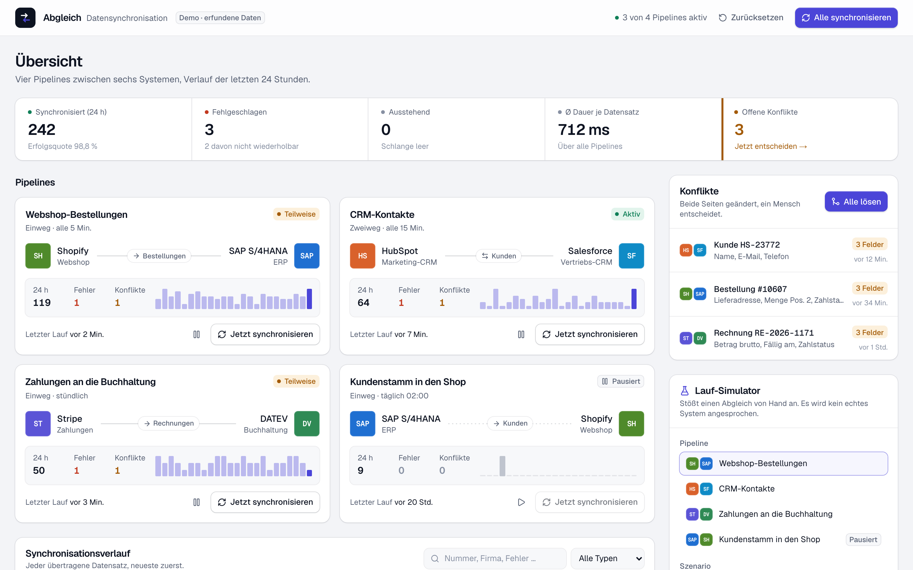
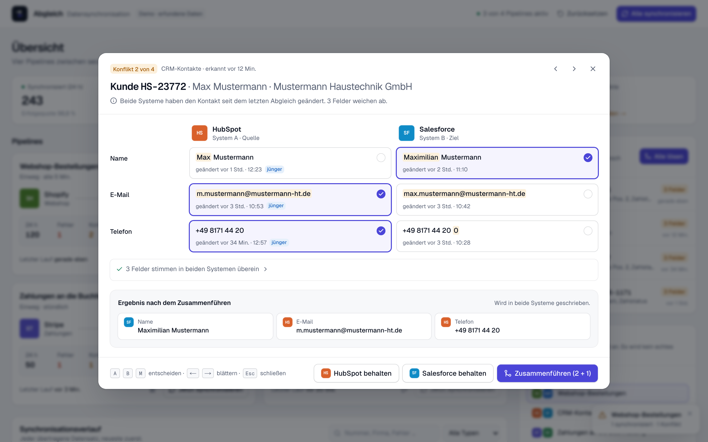
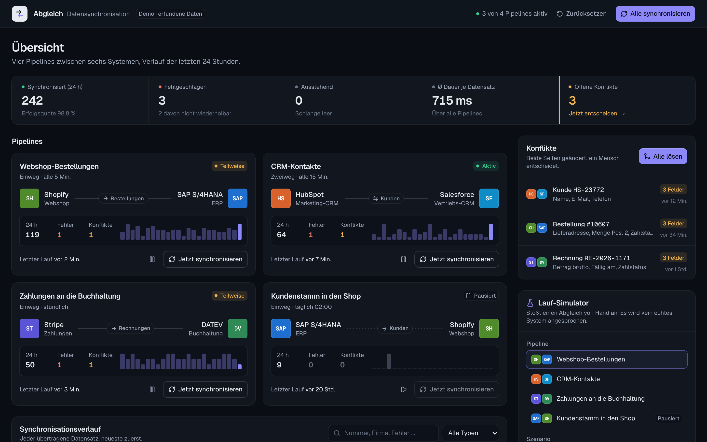

# Abgleich – Dashboard für Datensynchronisation (Demo)

Vorführstück von BKS Technologies. Zeigt, wie ein Betrieb den Datenabgleich zwischen Shop, ERP, CRM und
Buchhaltung im Blick behält und Konflikte entscheidet. **Alle Firmen, Personen und Zahlen sind erfunden.**



| Konflikt lösen | Dunkel |
|:---:|:---:|
|  |  |

## Was drin ist

- **Pipelines**: vier Verbindungen (Shopify → SAP, HubSpot ⇄ Salesforce, Stripe → DATEV, SAP → Shopify, pausiert)
  mit Zustand, Kennzahlen der letzten 24 Stunden, Stundenbalken, Pausieren/Fortsetzen und „Jetzt synchronisieren“.
- **Lauf**: vier Stufen (Extrahieren, Transformieren, Abgleichen, Schreiben) mit Fortschritt; neue Datensätze stehen
  sofort als „Ausstehend“ im Verlauf und bekommen am Ende ihr Ergebnis.
- **Verlauf**: alle Datensätze, neueste zuerst; Filter nach Status und Typ, Suche, „Erneut senden“ bei Fehlern.
  Nicht wiederholbare Fehler (fehlendes Pflichtfeld, festgeschriebene Periode) scheitern beim erneuten Senden wieder.
- **Konfliktlöser**: geteilte Ansicht System A / System B je Feld, geänderte Wörter markiert, jüngere Änderung als
  Vorschlag. „A behalten“, „B behalten“ oder „Zusammenführen“ mit Auswahl je Feld; Ergebnis-Vorschau, die beim
  Überfahren der Knöpfe mitgeht. Tastatur: `A`, `B`, `M`, `←`/`→`, `Esc`.
- **Simulator**: Pipeline und Szenario (Normal, Mit Konflikt, Mit Fehler) wählen und anstoßen; alle anstoßen;
  alle Fehler erneut senden.

## Grenzen

Kein Backend. Läufe, Fehler und Konflikte werden im Browser simuliert (`lib/store.ts`), der Stand liegt im
localStorage. „Zurücksetzen“ stellt den festen Ausgangsstand wieder her (drei offene Konflikte, drei Fehler).
Systeme erscheinen als Monogramme, nicht mit Herstellerlogos.

## Technik

Next.js 16 (App Router), React 19, TypeScript, Tailwind CSS 4, Zustand, Lucide. Hell und dunkel nach
Systemeinstellung. Tests mit Vitest für Zusammenführ-Logik und Simulation.

```bash
npm install
npm run dev     # http://localhost:3000
npm test
npm run lint
npm run build
```

## Veröffentlichen

Schritt für Schritt in [`VEROEFFENTLICHEN.md`](VEROEFFENTLICHEN.md): GitHub, Vercel (Frankfurt), Subdomain
`abgleich.bkstechnologies.de` bei IONOS, Abschnitt fürs GitHub-Profil (`docs/portfolio-abschnitt.md`).

Datenschutz ist ein gekennzeichneter Entwurf. Impressum-Fakten stammen aus `website/lib/site.ts`.
